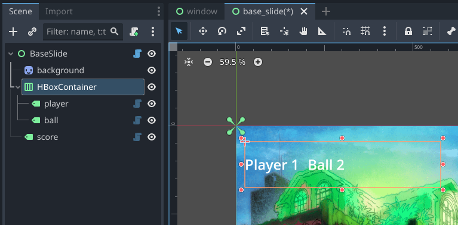

# Tutorial: Slide with Score, Player, and Ball

In this GMC tutorial we'll create a base slide for our game that includes the player score, ball number, and player number (when a multiplayer game is active).

## Configure the Slide Player

In your MPF config for your base mode, set the following:

``` yaml

    slide_player:
        mode_base_started: base
```

This will trigger the slide with a file name *base.tscn* when the base mode starts.

## Create a Base Slide

In the */modes/base* folder of your project, create a *slides* folder and in that folder create a new scene (*Create New > Scene*). Set the Root Type to be `MPFSlide` and save the file as *base.tscn*

Open the slide in the editor and add a new Node of type `Sprite2D`. Name this node "background". In the *Inspector* panel, under *Texture* choose *Quick Load* and select a nice background image. Drag the corners of the image node until it fills the dimensions of the slide.

## Add a Score
Add a new node of type `MPFVariable`, name it "score", drag the corners until it fills the full width of the slide, and move it down to the middle. In the *Label > Text* field enter "1,000,000" so you can visualize what the text will look like.

Lower in the *Inspector* panel, set *Label > Horizontal Alignment* to "Center". Expand *Theme Overrides > Font Sizes* and set the font size to be a large number, like 150px. Under *Colors* enable the *Font Outline Color* (the default black is fine), and under *Constants* set the *Outline Size* to 6. If you have a custom font you'd like to use, you can set that in the *Fonts* section.

You should now see "1,000,000" large in the middle of the slide. Go to the top of the *Inspector* panel and set the following values:

  * *Variable Type*: Current Player
  * *Variable Name*: score
  * *Comma Separate*: enabled
  * *Min Digits*: 2


You can now play the project, start MPF, and start a game. You'll see `00` appear at the beginning, and as you press keyboard inputs to score points, the score value will update automatically. Neat!

## Add a Ball Number: Theme Variants

Add another `MPFVariable` node, name it "ball", and position it in the upper-left corner. In the *Inspector* panel set the following values:

  * *Variable Type*: Current Player
  * *Variable Name*: ball
  * *Template String*: "Ball %s"
  * *Label > Text*: "Ball 1"

Rather than setting the font details for this variable explicitly, we will create a Theme that can be re-used throughout the project. In the *Inspector* panel under *Theme*, click the dropdown that says `<empty>` and select *New Theme*. A theme icon will appear in the dropdown, click it again to open the Theme Editor at the bottom of the screen.

On the right side of the Theme Editor next to *Type* click the plus icon and add a `Label` type. The Font tab will open below, click the plus icon to enable a theme font and then click on `<empty>` and *Quick Load* to select a font file from your fonts folder. The next tab is for font size, click the plus icon to enable a size and set the value to 40px.

At the top of the Theme Editor select *Save As...* and save the theme in your fonts folder (or a theme folder if you'd prefer) with a name for the font style, e.g. *body_md.tres*. In the *Inspector* panel, you should see your ball number label now has the theme *body_md*.

## Add a Player Number: Multiplayer-Only Variables

Create another `MPFVariable` like above, name it "player" set the *Variable Name* to `number`, then click the *Theme* `<empty>` dropdown and *Quick Load* to select the *body_md.tres* theme. Then set the following properties:

  * *Variable Type*: Current Player
  * *Variable Name*: number
  * *Template String*: "Player %s  "
  * *Min Players*: 2
  * *Label > Text*: "Player 1"

Note there are two extra spaces after the `%s` in the *Template String*, this is to create some extra space between the player and ball texts that only appears when the player text does. And the *Min Players* value means that the player text will only appear in a multiplayer game.

## Dynamic Variable Positioning with Containers

When these variables appear onscreen, we want them to be left aligned and the player number to be first (if present), so we can use Godot's built-in layout tools to automatically position them. In the *Scene* panel create a new node of type `HBoxContainer`, which is a container that will lay its children from left-to-right. Drag the corners of the node so it starts in the upper left corner and is tall enough and wide enough to cover the player and ball text. In the *Scene* panel drag the `player` and `ball` nodes onto the `HBoxContainer` to make them children of that container, and make sure the `player` node is first (above) and the `ball` node is second (below).



And that's it! You can start the project and run MPF to see it in action: the ball number will appear initially in the upper left corner, and when another player is added the player number will appear there and the ball number will shift to the right.