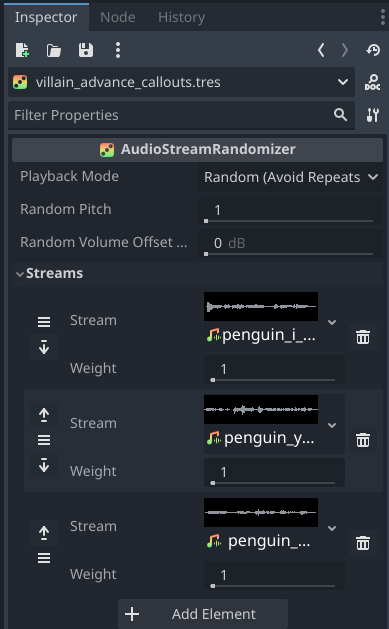

# Random Sound Pools with GMC

Sound playback can be randomized from a pool of sounds using Godot's built-in [AudioStreamRandomizer](https://docs.godotengine.org/en/stable/classes/class_audiostreamrandomizer.html) node. This node provides built-in support for collecting a pool of sound files, playing them back in sequential or random order, and adding random pitch and volume variations.

## Create an AudioStreamRandomizer Resource

A Godot node saved to a file is called a resource, and we'll create a new resource to represent our sound pool.

In the *FileSystem* panel navigate to your */sounds* folder and right click to *Create New > Resource*. Select `AudioStreamRandomizer` as the resource type and save it with a file name you'll use to reference the sound from MPF. In this case, we'll call it *villain_advance_callouts.tres*.

Save the file and you'll see it appear in the *FileSystem* panel. Select the file to bring up the *Inspector* panel on the right side.

## Add Sounds to the Pool

In the *Inspector* panel, click to expand the *Streams* section and *+ Add Element*. Click on the `<empty>` dropdown and use *Quick Load* to select a sound file from your project sounds folder. If you want this sound to be more or less likely to be chosen at random, you can adjust the *Weight* for a proportional value.

Repeat this step to add as many sound files as you'd like to the pool.



## Randomization Settings

#### *Playback Mode*
You can adjust how the pool is played back with this option.

   * *Random (No Repeats)* will randomly select sounds from the pool based on weight, but won't allow any sound to be played twice in a row.
   * *Random* will randomly select sounds from the pool based on weight.
   * *Sequential* will play the sounds in the order they appear. Use the up and down arrows on each stream to change its position.

#### *Random Pitch*
You can add pitch variation each time a sound from the pool is played. This is useful for generic effects like impacts, wooshes, and nonverbal vocals. Adding pitch variation can make only a handful of sound effects appear to be many more, and greatly reduces the perceived repetition of sounds.

#### *Random Volume*
You can add volume variation each time a sound from the pool is played.

## Play the Pool with `sound_player:`

With GMC, any Godot resource derived from `AudioStream` can be played directly from `sound_player`, and this includes `AudioStreamRandomizer`. So long as your resource file is saved in the root */sounds* folder (or a subfolder) or a */modes/(mode_name)/sounds* folder (or subfolder), it will be mapped by GMC as a sound name.

You can trigger playback of the sound from MPF by using the filename of the saved resource:

``` yaml

    sound_player:
        villain_advance:
            villain_advance_callouts:
                bus: voice
```

## Wrap the Sound Pool with MPFSoundAsset

If you want to leverage the properties of `MPFSoundAsset` like fade times and target bus, you can create an `MPFSoundAsset` resource and select your saved `AudioStreamRandomizer` as the *File*.

Alternatively, you can combine the sound pool and the MPF sound asset into a single resource. Create a new `MPFSoundAsset` resource and under *File*, instead of loading a sound file choose *New AudioStreamRandomizer*. This will create a new randomizer pool inside the `MPFSoundAsset` resource, and you can add streams and customize the pool like before. The randomizer will be saved as part of the same resource file so you don't need multiple files.


With the necessary playback settings included in the `MPFSoundAsset` resource, the sound player can be called as a one-liner.

``` yaml

    sound_player:
        villain_advance: villain_advance_callouts
```