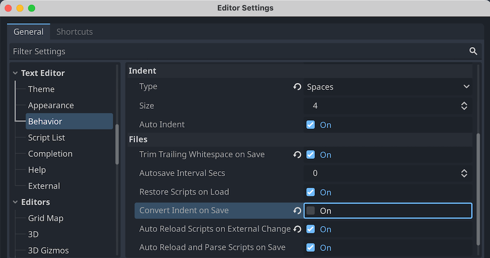
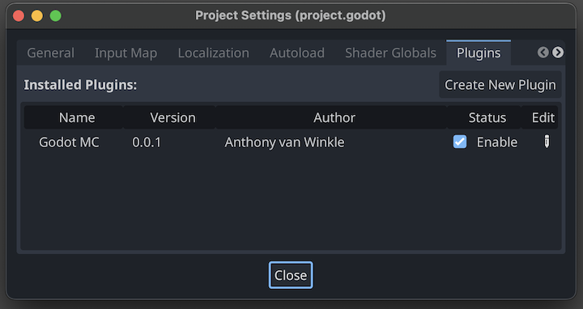

# Setup and Installation

!!! note "GMC is in Early Access"

    These instructions are for the early-access version of Godot MC, and require a few extra manual steps than the typical installation. You will need a functioning MPF 0.57+ project and a little patience :)

!!! warning "Please use a repository"

    Because GMC is in early access, you will likely be the first to encounter a scenario or request a feature. Having your project in a repository means that GMC developers can clone and run your game to quickly identify and fix issues, understand your goals, and validate requested features against your code. This is the fastest and smoothest way to make GMC better!

## Create a Virtual Environment for MPF 0.80

To support the new features and integrations of GMC, there is a new version of MPF in development. The first step, like with any MPF project, is to [create a virtual environment](../install/virtual-environments.md) that will keep this version of MPF and its dependencies separate from any other projects on your machine.

Follow the instructions linked above and create a new virtual environment in Python 3.8-3.11. For convenience, you may want to name the environment "mpf080" or "mpfgmc". Once you've created the environment, activate it and proceed to the next step.

## Download MPF 0.80 and MPF-GMC

Because the GMC is not yet released, pre-built binaries are not available and must instead be run locally. You will need two Git repositories: one for MPF 0.80, and one for GMC. It's recommended to create a special folder on your computer for your Git repositories—in this example we'll create a folder called "git" in our home directory.

First, clone the main MPF repository to your computer and then check out the 0.80 development branch.

``` console
  (mpf080) ~/git $> git clone https://github.com/missionpinball/mpf.git
  (mpf080) ~/git $> cd mpf
  (mpf080) ~/git/mpf $> git checkout 0.80.x
```

With the MPF source code on your machine, you can then use pip to install MPF. Unlike a normal pip installation, the `-e` flag instructs pip to run MPF directly from the source code rather than using a pre-compiled version. The period after the `-e` tells pip to install the package found in the current folder.

``` console
  (mpf080) ~/git/mpf $> pip install -e .
```

After MPF is installed, return back up to your main git folder and clone the GMC repository.

``` console
  (mpf080) ~/git $> git clone https://github.com/missionpinball/mpf-gmc.git
```

## Download Godot 4

The Godot Media Controller is, of course, built on the Godot game engine. Visit [https://godotengine.org](https://godotengine.org) to download the latest version of the Godot Editor (4.2 or later) and install it on your machine.

After Godot is installed, open the editor and create a New Project. Select your MPF game project folder as the project path, and choose an appropriate render engine.

For most pinball games, *Mobile* rendering is the recommended balance between performance and featureset. If you plan to do advanced 3D graphics and complex rendering, choose *Forward+*. If you want to optimize your game to run on very low-powered hardware with limited rendering features, choose *Compatibility*. Note that you can change this setting at any time, so don't stress about it :)

!!! note "Root project vs GMC subfolder"

    Some users prefer to create a distinct "gmc" subfolder in their MPF machine folder, and save their Godot project there. This keeps the Godot Editor *FileSystem* tree cleaner because it's not filled with MPF config files, and can make it easier to navigate and maintain each piece independently.

    Note that Godot only has access to files in its project folder and below. If you choose to make a "gmc" subfolder for your Godot project, all slides, sounds, and widgets will need to be in those respective subfolders in the gmc folder (e.g. */gmc/slides/*), NOT in the MPF mode subfolders (e.g. */modes/attract/slides/*).

## Setup Godot Editor

The Godot Editor includes some default configuration options that may cause headaches for users, so the following tweaks are recommended:

### Indentation Setup

The GMC code is written with space-based indentation, but Godot not only defaults to tabs but defaults to auto-convert files. You are free to use tabs if that's your preference, but at least disabling the auto-convert will spare you grief.

From the *Editor* menu select *Editor Settings > Text Editor > Behavior*.

  *  In the *Indent* section change `Tabs` to `Spaces`.
  *  In the *Files* section **disable** the `Convert Indent on Save` option.



### Other Good Things

Also in the *Editor Settings > Text Editor > Behavior* menu:

  *  In the *Files* section, **enable** the `Trim Trailing Whitespace on Save` option, because it's just good practice.
  *  If you use an external text editor like VS Code or Atom, in the *Files* section **enable** the option `Auto Reload Scripts on External Change`.


## Symlink the GMC Plugin to your Project Folder

When GMC is officially released, it will be available to download and install with a single click from the Godot Asset Library. Until then, you will need to manually create an alias from your project to the GMC repository you cloned in a previous step.

In your game project folder, create a new folder called *addons*. Then create a symbolic link that will create an alias folder *mpf-gmc* in the addons folder that points to the *mpf-gmc* folder in the GMC repository.

The syntax is `sudo ln -s <path to GMC repository/addons/mpf-gmc> <path to project folder/addons/mpf-gmc>`, and will look something like this:

``` console
  (mpf080) $> sudo ln -s /Users/tommy/git/mpf-gmc/addons/mpf-gmc /Users/tommy/pinballgame/addons/mpf-gmc
```

When successful, you should see a new *mpf-gmc* folder in the *addons* folder you just created.

## Install the GMC Plugin

!!! note "There will be errors"

    During this step, at various points some pieces will be setup before others and Godot will present errors. It is safe to ignore them, we will restart Godot after this step and everything will be in order.

In the Godot Editor, open the *Project > Project Settings* menu and select the *Plugins* tab. You should see an option there for **Godot MC**, check the checkbox to enable the plugin.



Now go to the *Autoload* tab and click the folder icon to select an Autoload script. Navigate to the *addons/mpf-gmc* folder and choose the file *mpf_gmc.gd*. Under *Node Name* set the name to "MPF" (all caps) and press *Add*. You should see a new line appear with a checkbox enabled.


!!! warning

    Godot exposes autoloads by the given Node Name, and various components of GMC reference one another by the name "MPF". When adding the *mpf_gmc.md* autoload, you _must_ set the Node Name to **MPF** or the GMC will not function.

Close the Project Settings menu, save the project, and restart Godot.

You can now proceed to your [project setup](setup.md)!